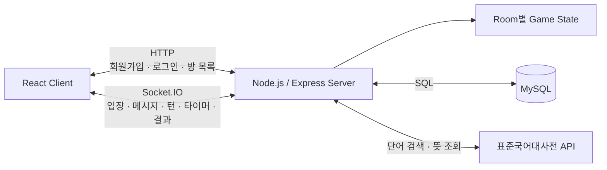

# ITZY - 실시간 온라인 끝말잇기

> React와 Node.js/Socket.IO로 구현한 Room 기반 실시간 끝말잇기 웹 게임


## 프로젝트 소개

ITZY는 여러 사용자가 같은 Room에 접속해 제한 시간 안에 끝말잇기를 진행하는 실시간 웹 게임입니다.

클라이언트는 사용자의 단어 입력과 서버 이벤트를 게임 화면에 반영하고, 서버는 Room별 플레이어 순서와 턴, 타이머, 단어 조건을 관리합니다. 입력된 단어는 표준국어대사전 API로 조회하며, 게임 결과는 MySQL의 사용자 누적 기록에 반영합니다.

### 핵심 기능

- 회원가입 및 로그인
- 닉네임과 Room 번호를 이용한 게임방 입장
- 같은 Room 사용자 간 실시간 메시지 동기화
- 입장 순서에 따른 플레이어 턴 관리
- 턴당 10초 제한 시간
- 표준국어대사전 API를 이용한 단어 및 뜻 조회
- 이전 단어의 마지막 글자를 이용한 끝말 조건 검사
- 정답·오답·라운드 종료 효과음
- 점수와 게임 종료 결과 표시
- 사용자 누적 점수 및 플레이 횟수 저장
- AWS EC2 환경에서 Node.js 서버 구동 및 외부 클라이언트 연결

## 담당 구현

### Client Side

- React Router를 이용한 로그인·접속·방 목록·게임 화면 구성
- React state를 이용한 메시지, 현재 단어, 턴, 점수와 결과 UI 관리
- Socket.IO 이벤트 수신 및 화면 상태 동기화
- 채팅형 단어 입력과 메시지 목록 자동 스크롤
- 정답·오답·라운드 종료 효과음과 결과 모달 구현

### Server Side

- Node.js/Express HTTP 서버 구축
- Socket.IO Room 기반 실시간 양방향 통신
- 접속 사용자와 Room 목록 관리
- 플레이어 입장 순서에 따른 턴 순환
- 10초 타이머와 라운드·게임 종료 처리
- 현재 턴, 사전 검색 결과와 끝말 조건 검증
- MySQL 회원 정보 및 누적 기록 연동
- AWS EC2 서버 구동 및 클라이언트 연결

## 기술 스택

| 구분 | 기술 | 사용 목적 |
|---|---|---|
| Client | React, React Router | 화면 구성과 페이지 이동 |
| Client | Axios | 회원가입·로그인 HTTP 요청 |
| Client | Socket.IO Client | 실시간 게임 이벤트 송수신 |
| Server | Node.js, Express | HTTP API 및 서버 구성 |
| Server | Socket.IO | Room, 턴, 타이머와 게임 이벤트 처리 |
| Database | MySQL | 계정과 누적 점수·플레이 횟수 저장 |
| External API | 표준국어대사전 API | 단어 검색 및 뜻 조회 |
| Deployment | AWS EC2 | 서버 실행 및 외부 접속 환경 |

## 시스템 구조



### HTTP와 Socket.IO의 역할

HTTP는 한 번의 요청과 응답으로 끝나는 기능에 사용했습니다.

- `POST /process/signup`: 회원가입
- `POST /process/login`: 로그인
- `GET /rooms`: 현재 Room 목록 조회

Socket.IO는 연결을 유지하며 반복적으로 상태를 주고받아야 하는 게임 기능에 사용했습니다.

- Room 입장과 인원 갱신
- 단어 제출과 메시지 방송
- 턴 시작과 제한 시간 동기화
- 정답·오답·라운드 종료 알림
- 게임 종료와 결과 표시

## 게임 진행 흐름

```text
로그인
  → 닉네임과 Room 번호 입력
  → Socket.IO 연결 및 Room 입장
  → 첫 번째 입장자가 게임 시작
  → 서버가 현재 플레이어와 10초 타이머 전송
  → 현재 플레이어가 단어 제출
  → 서버가 턴·사전 결과·끝말 조건 검사
  → 정답: Room 전체에 단어와 뜻 전송 후 다음 턴
  → 오답: 오답 이벤트 전송
  → 시간 초과: 라운드 종료
  → 세 번의 시간 초과 라운드 후 게임 종료 및 결과 저장
```

## 채팅형 단어 입력 구현

입력창은 일반 채팅과 별도의 게임 입력을 나눈 구조가 아니라, 끝말잇기 단어를 제출하는 채팅형 UI로 구성했습니다.

```text
Input.onChange
  → React message state 갱신
  → socket.emit('sendMessage', message)
  → 서버에서 사용자·Room·현재 턴 확인
  → 사전 API와 끝말 조건 검사
  → io.to(room).emit('message', ...)
  → 클라이언트 messages 배열에 추가
  → Messages → Message 컴포넌트 렌더링
```

메시지 목록은 함수형 state 갱신을 사용해 연속된 이벤트에서도 이전 목록을 기준으로 안전하게 추가했습니다.

```js
setMessages((previousMessages) => [
  ...previousMessages,
  receivedMessage,
]);
```

## Room과 턴 관리

서버는 접속 사용자를 메모리의 `users` 배열에 입장 순서대로 추가하고, 같은 Room의 사용자만 필터링합니다. 사용자는 `socket.join(room)`으로 Socket.IO Room에 가입합니다.

게임 시작 시 Room별 게임 상태를 생성합니다.

```js
games[room] = {
  currentPlayerIndex: 0,
  players: getUsersInRoom(room),
  timer: null,
  timeLeft: 10,
  round: 0,
};
```

정답이 인정되면 현재 플레이어 인덱스를 순환시켜 다음 턴을 시작합니다.

```js
game.currentPlayerIndex =
  (game.currentPlayerIndex + 1) % game.players.length;
```

## Socket 이벤트

| 이벤트 | 방향 | 역할 |
|---|---|---|
| `join` | Client → Server | 사용자와 Room 정보 전달 |
| `message` | Server → Client | 입장 메시지, 단어와 뜻 표시 |
| `roomData` | Server → Room | Room과 사용자 목록 전달 |
| `usersCount` | Server → Room | 접속 인원 전달 |
| `gameStart` | Client → Server | 게임 시작 요청 |
| `turnStart` | Server → Room | 현재 플레이어 인덱스 전달 |
| `timeLeft` | Server → Room | 남은 시간 전달 |
| `sendMessage` | Client → Server | 단어 제출 |
| `correctSignal` | Server → User | 정답 점수와 현재 단어 전달 |
| `wrongSignal` | Server → Room | 오답 효과음 신호 |
| `current` | Server → Room | 현재 단어 동기화 |
| `roundEnd` | Server → Room | 시간 초과 라운드 종료 |
| `sendScore` | Client → Server | 클라이언트 누적 점수 전달 |
| `gameover` | Server → Room | 게임 종료 결과 전달 |

## 디렉터리 구조

```text
Project_ITZY-main/
├─ client/
│  ├─ public/
│  └─ src/
│     ├─ bgm/                  # 정답·오답·라운드 효과음
│     ├─ icons/
│     ├─ components/
│     │  ├─ Signin/            # 회원가입·로그인
│     │  ├─ Join/              # 닉네임·Room 입력
│     │  ├─ Chat/              # Socket 연결과 게임 상태
│     │  ├─ Input/             # 단어 입력
│     │  ├─ Messages/          # 메시지 목록
│     │  ├─ Message/           # 개별 메시지
│     │  ├─ InfoBar/           # Room 정보
│     │  └─ ScoreBoard/        # 게임 종료 결과
│     └─ App.js                # Client routing
├─ server/
│  ├─ index.js                 # HTTP API와 Socket 게임 로직
│  ├─ users.js                 # 접속 사용자·Room 관리
│  └─ router.js                # 서버 상태 확인 route
└─ sign_upin_users.sql         # MySQL users table
```

## 로컬 실행

### 1. 데이터베이스 

```bash
mysql -u root -p < sign_upin_users.sql
```

서버의 MySQL 연결 정보는 실행 환경에 맞게 설정해야 합니다.

### 2. 서버 실행

```bash
cd server
npm install
npm start
```

기본 포트는 `5000`입니다.

### 3. 클라이언트 실행

```bash
cd client
npm install
npm start
```

기본 개발 주소는 `http://localhost:3000`입니다.

## 주의

현재 서버로 열어두었던 EC2와 데이터베이스에 대한 연결이 끊겼습니다.
실행하려면 로컬로 변환 후 실행해야합니다.

현재 저장소는 개발 당시 로컬 주소와 배포 주소가 코드에 남아 있습니다.
- `client/src/components/Signin/Signin.js`
- `client/src/components/Chat/Chat.js`
- `client/src/components/Rooms.js`

## License

학습 및 포트폴리오 목적으로 제작한 프로젝트입니다.
